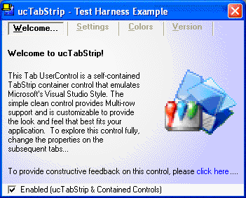



## ucTabStrip &\#8211; A Visual Studio Style TabsStrip Container\.

### Description

*UPDATE-v1.0.142* - Fixed Tab Offset for TabCount &gt; 10, Optimized Contained Controls Movement to allow for upto TabCount &lt;= 45. *UPDATE-v1.0.139* - Fixed GDI Leak in Circular Gradient Method which Caused out of Memory Error. ucTabStrip emulates the Microsoft&#8217;s Visual Studio Style while providing &#8220;true&#8221; container support not found in VB&#8217;s native version. In addition, this control provides multi-row support, 6 background gradient styles, 8 custom color properties, transparent tab headers style, tab mouse-over hovering, accelerator keys, and a host of appearance and alignment properties for allowing complete customization. Moreover, this control implements a rich assortment of public events (15) to provide the developer with the tools needed to get the job done. So if your looking for an alternative to the native controls, and don&#8217;t have time to build your own, then check out this little ditty&#8230;TerriTop
 
### More Info
 

             |
---                |---
**Submitted On**   |2006-06-29 00:03:36
**By**             |[TerriTop](https://github.com/Planet-Source-Code/PSCIndex/blob/master/ByAuthor/territop.md)
**Level**          |Intermediate
**User Rating**    |4.7 (47 globes from 10 users)
**Compatibility**  |VB 5\.0, VB 6\.0
**Category**       |[Custom Controls/ Forms/  Menus](https://github.com/Planet-Source-Code/PSCIndex/blob/master/ByCategory/custom-controls-forms-menus__1-4.md)
**World**          |[Visual Basic](https://github.com/Planet-Source-Code/PSCIndex/blob/master/ByWorld/visual-basic.md)
**Archive File**   |[ucTabStrip2003346292006\.zip](https://github.com/Planet-Source-Code/territop-uctabstrip-8211-a-visual-studio-style-tabsstrip-container__1-65642/archive/master.zip)

